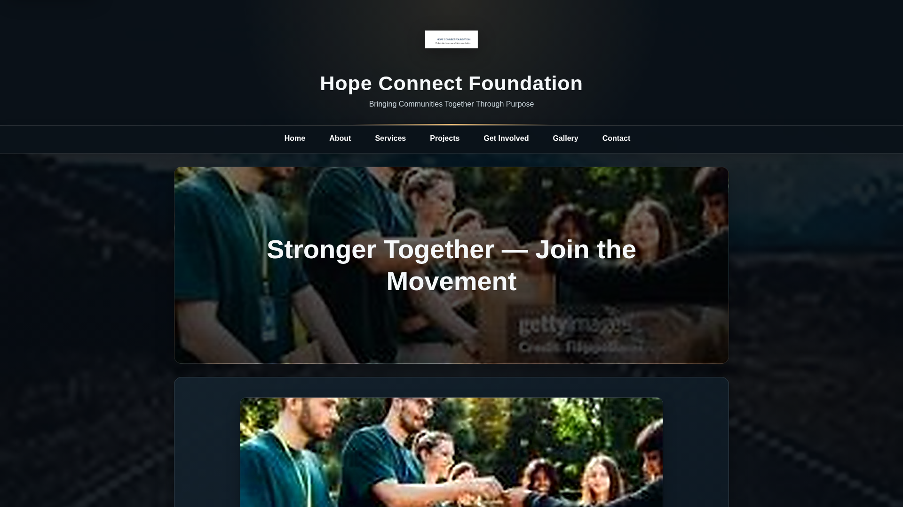
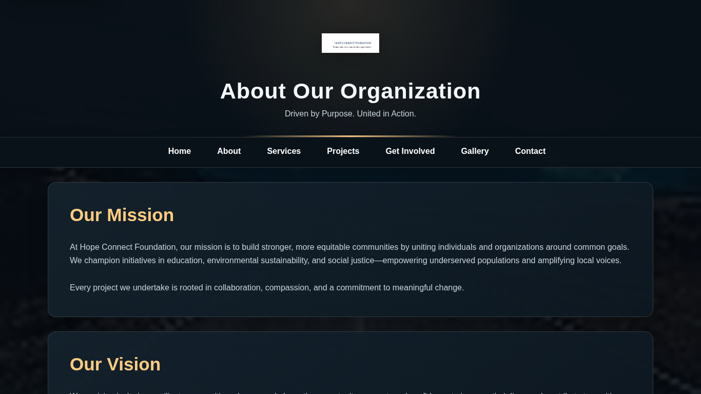
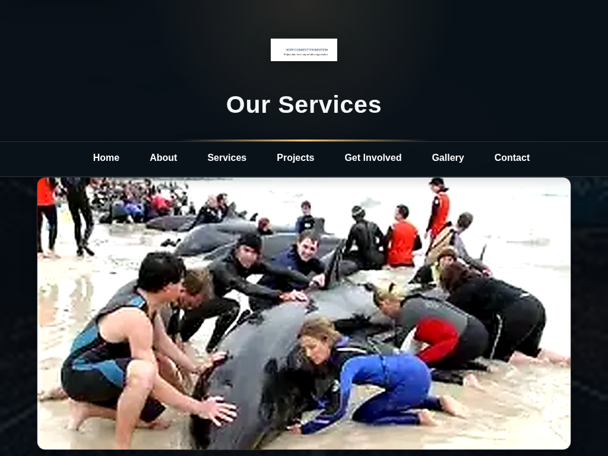
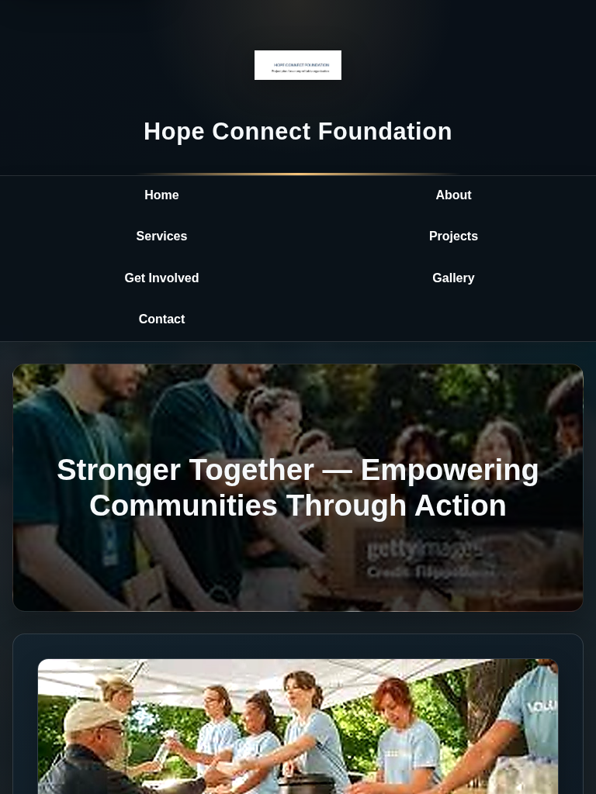
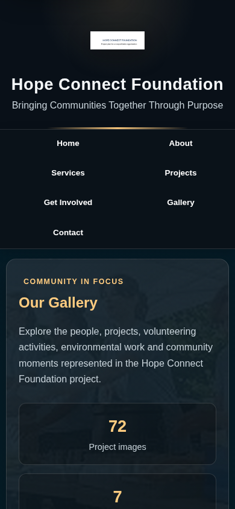
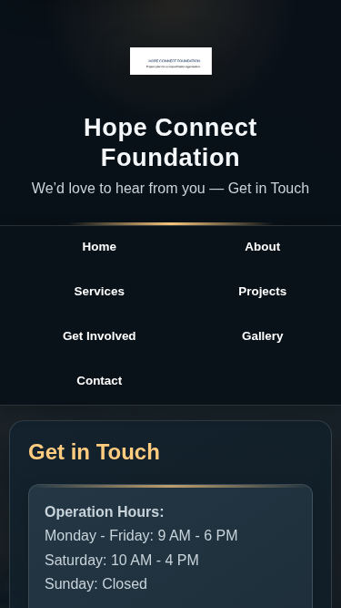

# Hope Connect Foundation - WEDE5020 Part 2

**Student:** Calvin Ramabusha  
**Student Number:** ST10502254  
**Module:** WEDE5020  
**Project:** Hope Connect Foundation Website  

## 1. Project Overview

Hope Connect Foundation is a non-profit organisation website developed for the WEDE5020 module. Part 2 builds on the Part 1 website by applying CSS styling, responsive design and usability improvements.

The Part 2 implementation focuses on a shared external stylesheet, consistent visual design, typography, Flexbox, CSS Grid, interactive states, responsive images, accessibility and testing across desktop, tablet and mobile screen sizes.

## 2. Website Pages

| Page | File |
|---|---|
| Home | `index.html` |
| About | `about.html` |
| Services | `services.html` |
| Projects | `projects.html` |
| Gallery | `gallery.html` |
| Get Involved | `get-involved.html` |
| Contact | `contact.html` |

## 3. Project Structure

```text
st10502254wede5020/
├── index.html
├── about.html
├── services.html
├── projects.html
├── gallery.html
├── get-involved.html
├── contact.html
├── README.md
├── css/
│   └── style.css
├── js/
│   └── script.js
├── images/
│   ├── responsive/
│   ├── testing-desktop-home-1920x1080.png
│   ├── testing-desktop-about-1366x768.png
│   ├── testing-tablet-services-1024x768.png
│   ├── testing-tablet-projects-768x1024.png
│   ├── testing-mobile-gallery-390x844.png
│   └── testing-mobile-contact-375x667.png
└── wireframes/
```

## 4. External CSS Stylesheet

All seven website pages use the shared external stylesheet:

`css/style.css`

The stylesheet provides:

- CSS reset and base styling
- Consistent colour variables
- Font family, font size, font weight, line height and letter spacing
- Consistent margins, padding and spacing
- Flexbox layouts for navigation and content sections
- CSS Grid layouts for cards, projects and galleries
- Borders, shadows, gradients and other visual styling
- `:hover`, `:focus-visible` and `:active` states
- Responsive breakpoints and relative units
- Responsive typography using `clamp()`
- Reduced-motion support
- Print-friendly styling

## 5. Typography

Typography was styled using CSS properties including:

- `font-family`
- `font-size`
- `font-weight`
- `line-height`
- `letter-spacing`

Relative units such as `rem`, `em`, `%`, `vw` and `vh` are used for responsive sizing and spacing. `clamp()` is used where appropriate to allow text and spacing to scale between screen sizes.

## 6. Layout Design

The website uses both Flexbox and CSS Grid to create flexible desktop and responsive layouts.

**Flexbox** is used for areas such as:

- Main navigation
- Navigation controls
- Content alignment
- Flexible component layouts

**CSS Grid** is used for areas such as:

- Project cards
- Service cards
- Gallery layouts
- Multi-column content sections

Larger layouts reduce to fewer columns or a single column on smaller screens to improve readability and usability.

## 7. Visual Styling and Interaction

The visual design uses:

- Consistent colours and backgrounds
- Borders and rounded elements
- Box shadows
- Gradients
- Responsive spacing
- Hover effects
- Focus indicators
- Active states
- Transitions

These styles provide visual hierarchy and clear feedback when users interact with navigation links, buttons, forms and gallery elements.

## 8. Responsive Design

The website was designed to respond to desktop, tablet and mobile screen sizes.

### Breakpoints

| Device | Breakpoint |
|---|---|
| Mobile | Up to 767px |
| Tablet | 768px to 1023px |
| Desktop | 1024px and above |

Additional adjustments are used at smaller intermediate widths where required to improve navigation, typography, spacing and content layout.

Responsive design includes:

- Flexible widths using `%`
- Responsive spacing using `rem` and `em`
- Responsive viewport units such as `vw` and `vh`
- `clamp()` for scalable typography and spacing
- Multi-column layouts on larger screens
- Single-column layouts on smaller screens
- Responsive navigation
- Mobile-friendly cards, forms and gallery layouts
- Prevention of unnecessary horizontal scrolling

## 9. Responsive Images

Responsive image techniques were added using `srcset` and `sizes` attributes. Resized image variants are stored in:

`images/responsive/`

The browser is able to select a suitable image resource based on the available display size and device resolution. This improves responsive presentation and avoids loading a larger image than necessary where an appropriate alternative is available.

## 10. Accessibility and Usability

Accessibility and usability were considered throughout the website. Features include:

- Descriptive `alt` text for images
- Skip-to-main-content links
- Visible keyboard focus indicators
- `:focus-visible` styling
- Accessible form controls and labels
- Clear navigation states
- Mobile-friendly touch targets
- Reduced-motion support
- Responsive layouts for different devices

## 11. Part 1 Feedback and Part 2 Changelog

The following changes were made during the Part 2 development and enhancement process:

### CSS and Visual Design

- Created and maintained the shared external `css/style.css` stylesheet.
- Linked the external stylesheet to all seven website pages.
- Added a consistent colour palette and typography system.
- Added consistent spacing, borders, shadows and visual hierarchy.
- Applied CSS Grid to project, service and gallery layouts.
- Applied Flexbox to navigation and responsive content structures.
- Added `:hover`, `:focus-visible` and `:active` interaction states.

### Responsive Design

- Added desktop, tablet and mobile breakpoints.
- Applied relative units including `rem`, `em`, `%`, `vw` and `vh`.
- Added `clamp()` for responsive typography and spacing.
- Improved navigation behaviour on smaller screens.
- Changed multi-column layouts to fewer columns or single-column layouts at smaller widths.
- Improved cards, forms, project sections and gallery layouts for smaller screens.

### Images and Accessibility

- Improved image presentation and responsive sizing.
- Added `srcset` and `sizes` attributes for responsive images.
- Added resized image variants in `images/responsive/`.
- Improved image framing and object fitting.
- Added skip navigation and keyboard focus indicators.
- Added reduced-motion support.
- Improved form control sizing, labels and usability.

### Project Maintenance

- Removed the obsolete `css/# mystyle.css` file.
- Corrected HTML structure and image markup issues identified during technical checking.
- Confirmed that all seven website pages are included.
- Confirmed that the project wireframes are included.
- Confirmed that the supplied project image collection is used throughout the website.
- Removed duplicate README-related documentation files from the final submission package.

## 12. Browser Developer Tools Testing

The website should be tested using browser Developer Tools with device emulation enabled. Testing should confirm that the website remains usable and visually consistent at different viewport sizes.

### Required Test Viewports

| Device category | Viewport | Page used for evidence |
|---|---:|---|
| Desktop | 1920 × 1080 | Home |
| Desktop | 1366 × 768 | About |
| Tablet | 1024 × 768 | Services |
| Tablet | 768 × 1024 | Projects |
| Mobile | 390 × 844 | Gallery |
| Mobile | 375 × 667 | Contact |

During testing, check:

- Navigation and menu behaviour
- Text readability and wrapping
- Image responsiveness
- Card layouts
- Form usability
- Gallery behaviour
- Interactive elements
- Horizontal overflow
- Spacing and alignment
- Breakpoint transitions

## 13. Screenshot Evidence

The responsive testing screenshots are stored together in the main `images/` folder. They are linked directly below using relative paths so that they display correctly when the README is viewed in the project repository.

### Desktop Testing

**Figure 1: Home page tested at 1920 × 1080.**



**Figure 2: About page tested at 1366 × 768.**



### Tablet Testing

**Figure 3: Services page tested at 1024 × 768.**



**Figure 4: Projects page tested at 768 × 1024.**



### Mobile Testing

**Figure 5: Gallery page tested at 390 × 844.**



**Figure 6: Contact page tested at 375 × 667.**



### Testing Checks

The responsive testing covered:

- Navigation and menu behaviour
- Text readability and wrapping
- Responsive image presentation
- Card and grid layouts
- Form usability
- Gallery layout and controls
- Interactive elements
- Horizontal overflow
- Spacing and alignment
- Breakpoint changes between desktop, tablet and mobile layouts

## 14. Reflection

Through this project, I gained practical experience in applying CSS styling principles and responsive web design techniques. I learned how Flexbox and CSS Grid can be used to create flexible layouts and how responsive design improves the user experience across different devices. I also developed a better understanding of accessibility considerations and how small design choices can make websites easier to use for a wider range of users.

The testing process also helped me identify layout and presentation issues at smaller screen sizes. I used the results to adjust navigation, spacing, typography, cards and image presentation so that the website remains usable across different viewport sizes.

## 15. Final Part 2 Submission Checklist

- [x] External `css/style.css` created and used.
- [x] All seven HTML pages linked to the external stylesheet.
- [x] CSS reset and base styling implemented.
- [x] Typography styling implemented.
- [x] Flexbox used for responsive layouts.
- [x] CSS Grid used for multi-column layouts.
- [x] Colours, borders, shadows and visual effects applied.
- [x] `:hover`, `:focus-visible` and `:active` states included.
- [x] Desktop, tablet and mobile breakpoints implemented.
- [x] Relative units including `%`, `rem`, `em`, `vw` and `vh` used.
- [x] `clamp()` used for responsive sizing.
- [x] Responsive images implemented with `srcset` and `sizes`.
- [x] Responsive image variants stored under `images/responsive/`.
- [x] Accessibility and usability features implemented.
- [x] Part 1 and Part 2 changes documented in the changelog.
- [x] Desktop, tablet and mobile testing screenshots included under `images/`.
- [x] Screenshot evidence linked directly from this README.
- [x] Wireframes included in the `wireframes/` folder.

