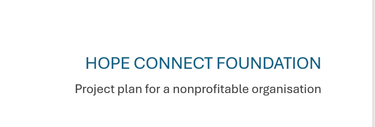

# Hope Connect Foundation - Organized Website

## Folder structure

- `index.html` - Home page
- `about.html` - About page
- `services.html` - Services page
- `projects.html` - Projects page
- `get-involved.html` - Get Involved page
- `gallery.html` - Gallery page
- `contact.html` - Contact page
- `images/` - All local website images
- `css/style.css` - Main stylesheet file

## Image paths

All local images used by the HTML pages now use the `images/` folder, for example:

```html

```

The website still uses Font Awesome and the existing online background resources where those were already part of the project.
